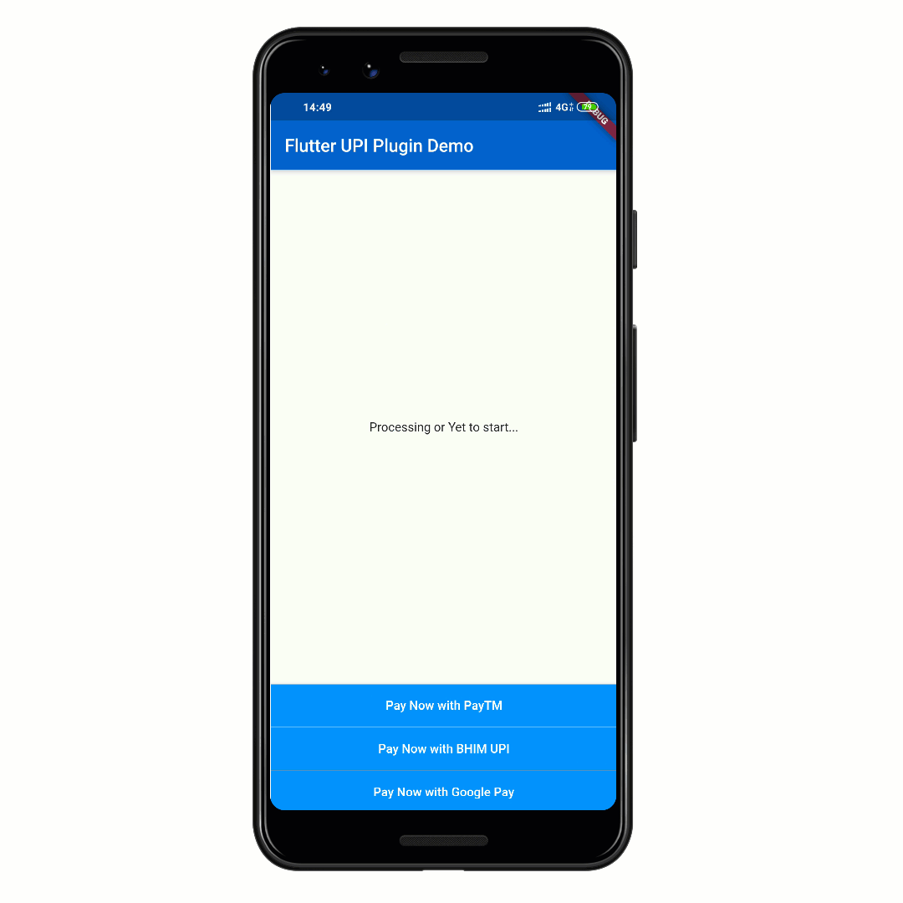

# FlutterUPI Plugin

A flutter plugin to invoke UPI apps on the phone for Android and get the transaction information in response. This plugin supports only Android as of now.



## Getting Started

Simply import the plugin

```
import 'package:flutter_upi/flutter_upi.dart';
```

And then use the `initiateTransaction` method as shown in the code below.

```
String response = await FlutterUpi.initiateTransaction(
    app: FlutterUpiApps.PayTM,
    pa: "receiver@upi",
    pn: "Receiver Name",
    tr: "UniqueTransactionId",
    tn: "This is a transaction Note",
    am: "5.01",
    mc: "YourMerchantId", // optional
    cu: "INR",
    url: "https://www.google.com",
);

print(response);

```

The `response` is a `String` that contains all the relevant information. Here is how the String looks like.

```
txnId=PTM2008fadf6e7242a4a86d72daef6efa66&responseCode=0&ApprovalRefNo=913338799016&Status=SUCCESS&txnRef=TR1234
```
Please note that some parameters in the response can be undefined when using different apps.

### Parsing the Response
You can write your own logic to parse the response string or you can use the `FlutterUpiResponse` class to create a `Map` out of it.
```
FlutterUpiResponse flutterUpiResponse = FlutterUpiResponse(response);
print(flutterUpiResponse.txnId); // prints transaction id
print(flutterUpiResponse.txnRef); //prints transaction ref 
print(flutterUpiResponse.Status); //prints transaction status
print(flutterUpiResponse.approvalRefNo); //prints approval reference number
print(flutterUpiResponse.responseCode); //prints the response code
```

## Supported Apps and Platforms
As of now the plugin only supports Android. Since I am not an iOS developer, I have only been able to write the code for Android. If you are interested, feel free to get in touch or create PR if you can do this for iOS as well.

The plugins supports three apps as of now which I have tested this plugin with. You can use the predefined constants in the `FlutterUpiApps` class and pass it to the `app` named argument in the `initiateTransaction` method.

`FlutterUpiApps.BHIMUPI` will launch the BHIM UPI App 

`FlutterUpiApps.GooglePay` will launch the GooglePay App

`FlutterUpiApps.PayTM` will launch the PayTM App

`FlutterUpiApps.PhonePe` will launch the PhonePe App

`FlutterUpiApps.MiPay` will launch the MiPay App

`FlutterUpiApps.AmazonPay` will launch the AmazonPay App

`FlutterUpiApps.TrueCallerUPI` will launch the TrueCallerUPI App

`FlutterUpiApps.MyAirtelUPI` will launch the MyAirtelUPI App

## Error Responses
The `response` String can contain any of the following strings as well.

`app_not_installed` : Application not installed.

`invalid_params` : Request parameters are wrong.

`user_canceled` : User canceled the flow.

`null_response` : No data received.


You need to write your own code to handle these responses in your app. Check out the example folder for more implementation details.

### Report any issues if you face any or drop me an email at samarthagarwal@live.com


